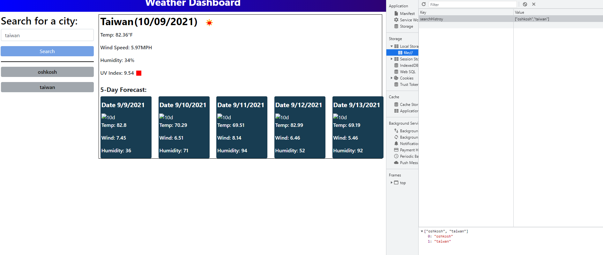

# weather-dashboard
## Discription
I was tasked with creating a weather dashboard that allows a user to search for a city name. then make an api call to open weather,
to list specified conditions for that city. I also needed to store that city name in a list of previously serched cities. Those list
items needed to be clickable to recall the weather conditions like it did in the initial call.

## Deployed URL
https://raidernationbuilder.github.io/weather-dashboard/

## Screenshots

